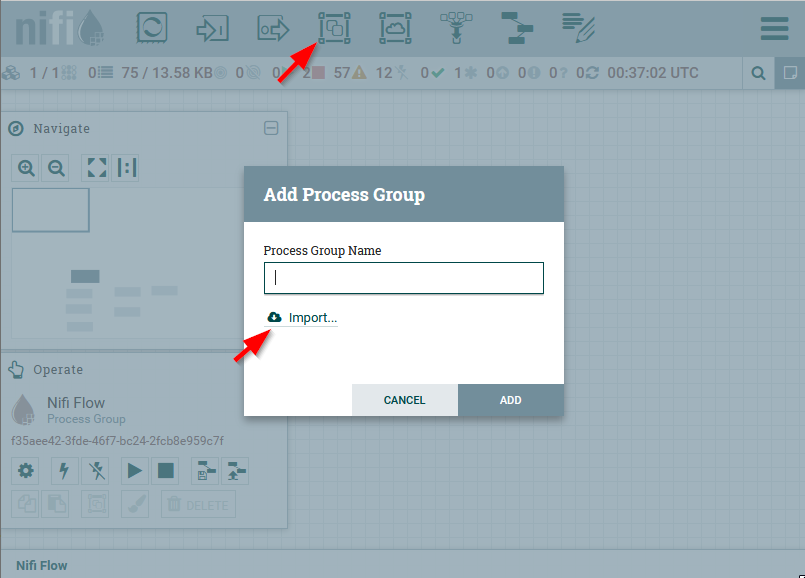
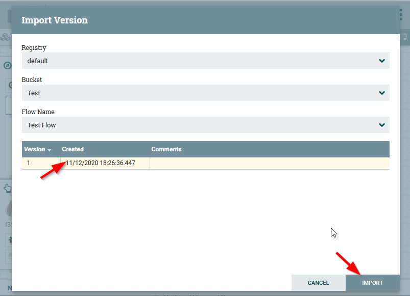

# Clinical Ingestion Helm Charts

## Introduction

This directory contains the [Helm](https://github.com/kubernetes/helm) charts used to install the Alvearie Clinical Ingestion pattern in a Kubernetes cluster.

There are three main charts contained in this directory:

- [FHIR Chart](./fhir): Chart used to install a FHIR server
- [NiFi Registry](./nifi-registry): Chart used to install a [NiFi Registry](https://nifi.apache.org/registry.html)
- [Clinical Ingestion Pattern](./alvearie-ingestion): Chart used to install the Alvearie Clinical Ingestion pattern


## Installation

The charts here can be installed individually, however in order to deploy the full [Alvearie Clinical Ingestion pattern](./alvearie-ingestion) (with its dependencies) install the corresponding chart following the instructions listed in the corresponding link *(3 minutes)*.

After installing that chart your Kubernetes cluster will have a NiFi server pointing to a NiFi Registry with pre-loaded [Clinical Ingestion Nifi Components](https://github.com/Alvearie/health-patterns/tree/initial-charts/nifi-components), so you may skip the instructions listed there and follow the instructions below *(2 minutes)*.

### Import the NiFi Ingestion Components

1. Drag a new _Process Group_ from the NiFi toolbar on to the canvas

2. Select _Import..._ 



_Note: We have occasionally seen a lag in NiFi where it may take a bit for it to detect the NiFi Registry and offer the Import... button_

3. Leave the default _NiFi Registry_, _Bucket_ and _Flow Name_ selections, select the latest version and click _Import_



That's it! 

You should be ready to exercise the operations described in the [Configuring NiFi for the Clinical Ingestion Flow](https://github.com/Alvearie/health-patterns/tree/initial-charts/clinical-ingestion#configuring-nifi-for-the-clinical-ingestion-flow) and running a FHIR bundle through it.

## Contributing

Feel free to contribute by making a [pull request](https://github.com/Alvearie/health-patterns/pull/new/master).

Please review the [Contributing Guide](CONTRIBUTING.md) for information on how to get started contributing to the project.

### Running Github Chart Linting Locally

This notes describe the necessary steps to lint a chart in a local dev env.

There is a Github Action that will automatically lint the Alvearie Ingestion charts when a corresponding PR is created, however it is convenient to have a way to reproduce that process locally to avoid having to push a PR just to be able to run the official linting process.

The chart linting process is done using a Github Action called *helm/chart-testing-action@v2.0.1*. That action runs a docker image that contains the chart-testing tool and runs the chart through the tool. 

You can reproduce that process locally by running that same Docker image as follows:

- Create the chart-testing container (save the returned container ID from the following command):

```
cd ~/git/health-patterns
docker container run --interactive --tty --detach --volume "$(pwd):/workdir" --workdir /workdir "quay.io/helmpack/chart-testing:latest"
```

- Run the `ct lint` command in the container:

```
docker exec <conatiner-id> ct lint --chart-dirs clinical-ingestion/helm-charts --target-branch main --validate-maintainers=false --debug 
```

`ct lint` runs:
- chart version check
- yamale for Chart validation by schema of Chart.yaml
- yamllint (not so much syntax but more cosmetic and conventional) for  Chart.yaml and values.yaml
- maintainers check (names need to match a github username) (disabled)
- helm lint

## License
[](https://opensource.org/licenses/Apache-2.0) 
