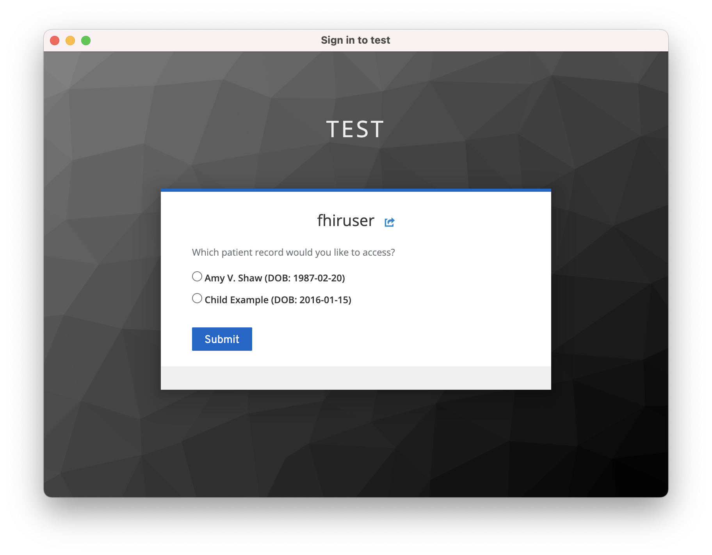

# Health Data Access
Health Data Access is a reference implementation for providing patient or practitioner scoped access to clinical and/or financial health data.
It uses the [IBM FHIR Server](https://ibm.github.io/FHIR) together with a SMART App Launch authorization server that is built on [Keycloak](https://www.keycloak.org).

See https://alvearie.io/blog/smart-keycloak for an overview.

## Exercising the pattern
Currently, this pattern is packaged via docker-compose.
It relies on:
1. the publicly available ibmcom/ibm-fhir-server image
2. publicly available images from https://github.com/Alvearie/keycloak-extensions-for-fhir
    * alvearie/smart-keycloak
    * alvearie/keycloak-config

### Prerequisites
Because this pattern is configured for data access (and not data ingestion), the FHIR server is configured to be read-only.
To make it easier to execute the pattern, we include a sample database under data-access/fhir/derby/sampleDB.zip.
To use this sample database, unzip it to `data-access/fhir/derby` before launching the docker-compose environment for the first time.
The result should be a directory at `data-access/fhir/derby/fhirDB` that has the contents of the sample database.

### Docker compose
Execute the following commands from *this repo's* data-access directory (the one that has this README) to package the `fhir-smart` authorization addon with the IBM FHIR Server and spin up the fhir-server and keycloak services:

```
mvn clean package

docker-compose up -d
```

Once the services are up, execute the following to configure a new realm on the keycloak service:

```
docker run -e FHIR_BASE_URL=http://fhir-server:9080/fhir-server/api/v4 alvearie/keycloak-config
```

Finally, execute the following to tail the logs while it runs:

```
docker-compose logs -f
```

### Driving SMART App Launch from Postman
Now that the docker-compose environment is running, you can use Postman (or any other test client that supports OAuth 2.0 / OpenID Connect) to log in and access the FHIR API.

1. Discover the authentication and token endpoints from https://localhost:9443/fhir-server/api/v4/.well-known/smart-configuration

2. Create a new postman request, navigate to the Auth tab, select OAuth 2.0 and enter the following fields
    * Token Name:  demo (or anything else)
    * Grant Type:  Authorization Code
    * Callback URL:  http://localhost:4567/inferno/static/redirect (must match a registered callback URL for a corresponding client in Keycloak)
    * Auth URL:  https://localhost:8443/auth/realms/test/protocol/openid-connect/auth
    * Access Token URL:  https://localhost:8443/auth/realms/test/protocol/openid-connect/token
    * Client ID:  inferno (must match a registered client)
    * Client Secret:  (blank for public clients)
    * Scope:  launch/patient openid fhirUser offline_access patient/*.read (see [SMART App Launch: Scopes and Launch Context](http://www.hl7.org/fhir/smart-app-launch/scopes-and-launch-context/index.html#quick-start))
    * State:  1234 (any random value)
    * Client Authentication:  Send as Basic Auth header
    
    

3. Click `Get New Access Token` and enter the username and password of a registered user. For convenience, the default `alvearie/keycloak-config` image creates a single user with username `fhiruser` and password `change-password`. The user *must* have a corresponding `resourceId` attribute which matches the id of the corresponding Patient resource on the FHIR server.

4. Consent and proceed. By default, the consent screen will only appear for a user a single time (per client).

5. On the Token Details dialog, scroll to the bottom and look for the `patient` attribute. The value of this attribute should come from the corresponding `resoourceId` attribute of the user in Keycloak. If you are using the default `alvearie/keycloak-config` config, this should be `Patient1`.

6. Scroll back to the top of the Token Details page and click `Use Token`. This will automatically associate this access token with your request.

7. Click `Send`. The response should contain only resources associated with this user. If you are using the default `fhiruser` user and the sampleDB provided with this pattern, you should see four ExplanationOfBenefit resources returned from the server.

#### Delegated user access
What if the end user has access to multiple different patient records? The Keycloak extensions for FHIR provides a patient context picker.

1. Navigate to http://localhost:8080/auth/admin and login as the admin user (admin/admin by default).

2. Ensure you are on the Test realm and navigate to the [Users](http://localhost:8080/auth/admin/master/console/#/realms/test/users) page.

3. Click `View all users` and select the user from the list.

4. Navigate to the Attributes tab and add another value to the list of values, separating each id with a single space. For example, if you are using the sampleDB, try changing `Patient1` to `Patient1 1` and click `Save`.

5. Now head back to Postman, click `Get New Access Token`, and re-enter the login credentials. This time, you should be prompted with a patient selection form. The patient information on this form is populated from information that is retrieved from the configured FHIR resource server.
    

6. Choose a patient and press Submit. Then, on the Token Details dialog, scroll to the bottom to see the resourceId that is associated with the patient you selected in the patient attribute of the token response body.

7. Scroll back to the top of this page, click `Use Token`, and submit the request, confirming you are still able to access the ExplanationOfBenefit resources for the patient(s) associated with this user.

## Future music
* Move to helm chart and integrate with the clinical-ingestion pattern's fhir-server

* Support user-scoped interactions (SMART App Launch for scopes beginning with `user/` instead of `patient/`).

* FHIR Terminology Service - The IBM FHIR Server can either act as a terminology server or integrate with external terminology services (or both). The main benefit to this from a data access perspective is that it allows for advanced searching like:
  * get all the patients that have an active Condition with a diagnosis code in some particular value set; or
  * get all the encounters for which a clinical observation was made with a code under this particular branch of SNOMED CT