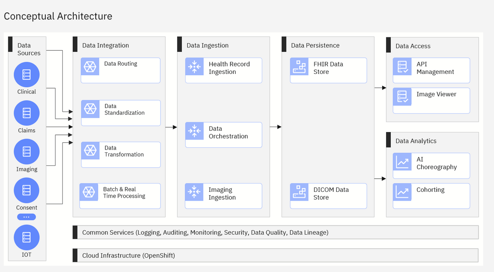

# Welcome to health-patterns

health-patterns is where to find cloud agnostic reference implementations for the overall Alvearie architecture (https://alvearie.io/architecture) that incorporate best practices using open technologies.  
The conceptual architecture below is brought into reality with a combination of implementations and documentation.  

Below are the initial patterns that incorporate parts of [Alvearie](https://alvearie.io/) along with other open technologies that can be used to start building your own healthcare solutions using a common base of proven technology.

## Clinical Data Ingestion

The _Clinical Ingestion_ health pattern with optional _Enrichment_ is a cloud agnostic (has been run on IBM Cloud, AWS, Azure, Google), flexible approach to processing healthcare data and storing it into a FHIR server.
At the most basic level, the Ingestion pattern will read HL7 or FHIR data from a [Kafka](https://kafka.apache.org) topic and use [NiFi](https://github.com/apache/nifi) to orchestrate any desired conversion or validation, and then store the results into the [FHIR Server](https://github.com/ibm/fhir)

- Within the [NiFi](https://github.com/apache/nifi) canvas, the _Clinical Ingestion_ health pattern will:
    - Convert [HL7 to FHIR using technology from LinuxForHealth](https://github.com/LinuxForHealth/hl7v2-fhir-converter)
    - Validate the FHIR data without storing it in the FHIR Server
    - Put the converted/validated data on a Kafka topic for processing by the _Enrichment_ pattern
    - Store the FHIR bundle into the [FHIR Server](https://github.com/ibm/fhir)
    - Handle errors:
        - In case of errors within the bundle, individual resources are retried
        - Errors are reported back to the data integrator via the kafka topic

Get started using the [clinical data ingestion & enrichment pattern today](https://github.com/Alvearie/health-patterns/tree/main/clinical-ingestion)

## Clinical Data Enrichment
The _Clinical Enrichment_ health pattern has been separated from the _Ingestion_ pattern.  It is still available to be deployed and run as part of ingestion, but it can also be set up on its own.
If it is run as part of _Ingestion_ it will Enrich the data as it comes into the environment, before it is stored in the FHIR Server.  It can also be run after the data is persisted in the FHIR server and configured to run on new or changed data.
The goal for this _Enrichment_ pattern is that the enriched data will be written to a FHIR server by default, but because these patterns are just reference implementations, they can be modified and consumed in a number of ways.

_Enrichment_ will read FHIR data from a [Kafka](https://kafka.apache.org) topic and use [NiFi](https://github.com/apache/nifi) to orchestrate the optional types of enrichment such as:
- Convert terminology using the FHIR Terminology Services
- [De-identify](https://github.com/Alvearie/de-identification) the FHIR data
- Run an algorithm such as [ASCVD](https://github.com/Alvearie/health-analytics/tree/main/ascvd)
- Run NLP against the unstructured data such as [FHIR DocumentReference](https://www.hl7.org/fhir/documentreference.html)

The flexibility of this approach allows the consumer to use enrichment at the appropriate time.  For instance, some of the enrichment could happen at Ingestion time (FHIR Terminology for  instance) prior to storing the data, but after the data is persisted in the FHIR Server, Enrichment can run again to only run NLP and/or an analtyic algorithm.

To get started today, use the [clinical data ingestion & enrichment pattern today](https://github.com/Alvearie/health-patterns/tree/main/clinical-ingestion) but watch this space - the _Enrichment_ pattern will be available separately soon.

## Quality Measure & Cohorting 
The _Clinical Data Cohorting_ pattern provides a reference implementation that uses the [quality measure & cohort service](https://github.com/Alvearie/quality-measure-and-cohort-service) to find patients within the FHIR server that match a given cohort as defined using [CQL](https://cql.hl7.org).

Get started using the [cohorting pattern today](https://github.com/Alvearie/health-patterns/tree/main/cohort-service)

## Clinical Data Access 
The _Clinical Data Access_ pattern shows how to configure access to the FHIR server for traditional access methods, in particular how to configure the FHIR server for [SMART on FHIR](https://smarthealthit.org/) using [Keycloak](https://www.keycloak.org/) and the [Keycloak extensions for FHIR](https://github.com/Alvearie/keycloak-extensions-for-fhir)

Get started using the [Data Access pattern today](https://github.com/Alvearie/health-patterns/tree/main/data-access)

## Clinical Data Analytics -- COMING SOON
In addition, the _Clinical Data Analytics_ reference implementation will incorporate various types of analytics using Kubeflow.  To begin, we will incorporate all of the analytics found in the _Enrichment_ pattern into Kubeflow by calling the same set of Microservices that were used by Enrichment.

We will have examples of 
- using single patient data from the FHIR server to score against a model
- bulk export data from the FHIR Server, transform the data and run the model/analytic in Kubeflow pipelines against multiple patients
- bulk export data from the FHIR Server and transform it to train a new model
- serving an existing trained model

The main Alvearie page shows the longer term [Alvearie architecture](https://alvearie.io/architecture) 

