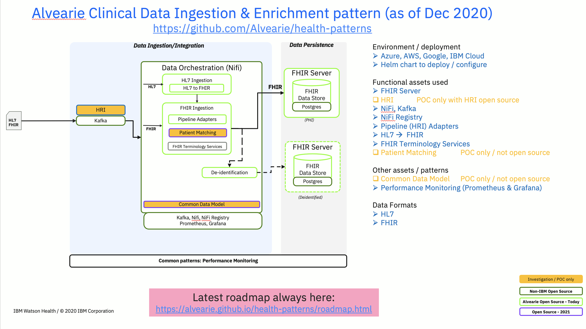

# health-patterns roadmap

## Clinical Data Ingestion & Enrichment

At the end of 2020, the _Clinical Ingestion & Enrichment_ health pattern has made great progress as shown below.  This pattern is cloud agnostic (has been run on IBM Cloud, AWS, Azure, Google) and allows the following 
- Take in HL7 or FHIR data from a source system (EMR, Data Warehouse, etc) via Kafka (preferred) or a simple API (mostly for testing)
- Within a [NiFi] (https://github.com/apache/nifi) canvas
- - Convert HL7 to FHIR using technology from LinuxForHealth (https://github.com/LinuxForHealth/hl7v2-fhir-converter)
- - Validate the FHIR data without storing it in the FHIR Server
- - Convert terminology using the FHIR Terminology Services
- - Store the FHIR bundle into the FHIR Server (https://github.com/ibm/fhir)
- - In case of errors within the bundle, individual resources are retried
- - Errors are reported back to the data integrator via the kafka topic
- - De-identify (https://github.com/Alvearie/de-identification) the FHIR data
- - Return the de-identified data and/or store the de-identified data into a second FHIR Server (with the same error handling as before)
-  [Prometheus] (https://github.com/prometheus) & [Grafana] (https://github.com/grafana/grafana) configured to monitor the environment
- Single helm chart to deploy & configure the above, with the flexibility to bring your own (BYO) services if you already have an instance that you want to use (Kafka or FHIR server or NiFi, etc)

Here is what the implemented architecture looks like currently 

Here is the longer term [Alvearie architecture] (https://alvearie.github.io/architecture) that includes additional Ingestion & Enrichment capabilities

**Next up** for the _Clinical Data Ingestion & Enrichment_ pattern:
- Add support for DICOM image ingestion & storage (expected early 2Q 2021)
- Additional enrichment capabilities (NLP, additional normalization, patient matching)
- Documentation & best practices around security, HIPAA compliance & multi-tenancy
- Incorporate any new Alvearie assets as appropriate

## Clinical Data Access & Analytics
The Clinical Data Analytics pattern will provide a reference implementation that gives examples of the use of the [quality measure & cohort service] (https://github.com/Alvearie/quality-measure-and-cohort-service) to find patients within the FHIR server that match a given cohort as defined using CQL (https://cql.hl7.org).

In addition, the Clinical Data Analytics reference implementation will incorporate ML models using Kubeflow.  We will have examples of 
- using single patient data from the FHIR server to score against a model
- bulk export data from the FHIR Server to run the model against multiple patients (or to use that data to train a new model)
- how to easily serve existing trained models
- build, train, tune new models
- incorporate the models into the Ingest & Enrich pattern or as something that runs after the data has landed in the FHIR server

Clinical Data Access pattern will show how to configure access to the FHIR server for traditional access methods
- SMART on FHIR
- Using an API Management solution like 3scale (https://github.com/3scale)
It will also show how to access the associated DICOM images for a patient.

Again, the main Alvearie page shows the longer term [Alvearie architecture] (https://alvearie.github.io/architecture) including Access & Analytics
