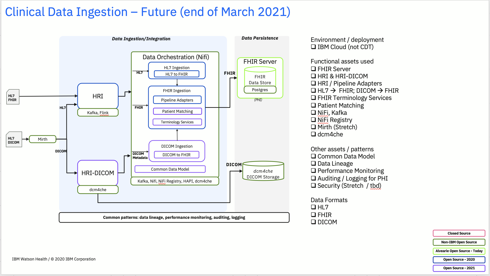
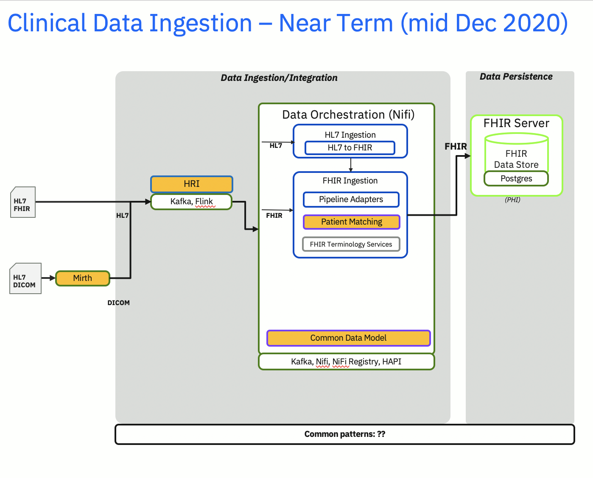
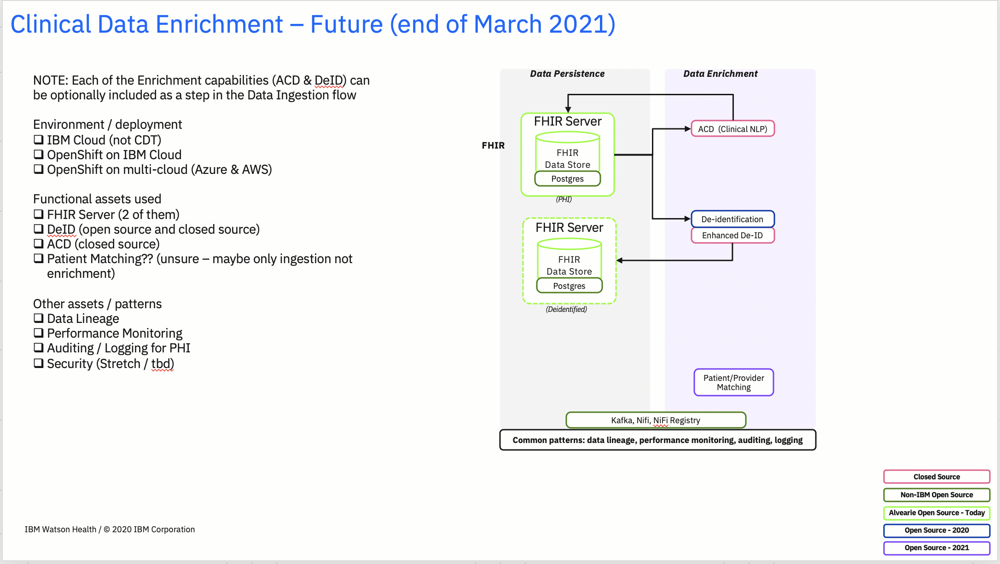

# health-patterns roadmap
health-patterns is a collection of documentation and reference implementations that highlight how to combine various technologies into meaningful patterns for healthcare.

By the end of the first quarter of 2021, we intend to have two reference implementations ready for use, with another one under construction.

## 1) Clinical Data Ingestion
This reference implementation will focus on the process of accepting data from a source system (EMR, Data Warehouse, etc), performing the necessary transformation & normalization and storing it in a persistence layer.  Initial data formats supported will include HL7, FHIR and DICOM and this version will persist the data in an industry standard FHIR Server as well as the dcm4che image store.

The end result architecture will look something like the following

While the goal for the end of 2020 will be this subset

## 2) Clinical Data Enrichment
Enrichment can happen as part of Ingestion or separately (after the data has been persisted).  
The 2 focus areas will be
1. the use of NLP to extract information from the unstructured patient notes.  Our implementation will show the use of IBM's Annotator for Clinical Data (ACD)
2. the ability to de-identify the patient information and persist the de-identified data in a second FHIR server

Enrichment by the end of March 2021

Enrichment by the end of 2020

The third reference implementation will focus on Clinical Data Access and Analytics.  More details to come on that pattern...
